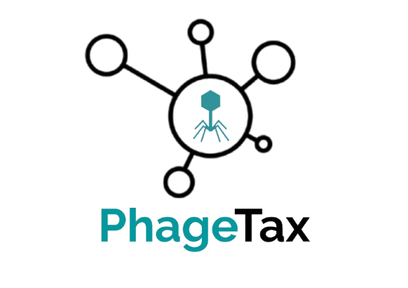

<p align="center">
  
</p>

# PhageTax: Automatic Taxonomic Classification of Bacteriophages

PhageTax is a bioinformatics tool designed for the automated taxonomic classification of bacteriophage genomes based on functional features (PHROG) and machine learning models.

The tool integrates genomic, taxonomic, and functional information to generate high-confidence predictions of viral taxonomy at multiple levels, from kingdom to species.

---

## 🚀 **Features**

✔ Automated genome annotation with [Pharokka](https://github.com/gbouras13/pharokka)  
✔ Extraction of PHROG presence/absence features  
✔ Integration of genome statistics (length, GC content, number of genes)  
✔ Taxonomic classification at six hierarchical levels  
✔ Confidence scores for each prediction  
✔ PHROGs specificity and characteristic reports  
✔ Modular and portable pipeline  

---

## 🗂 **Repository Structure**

```
phagetax/
├── phagetax.py             # Main executable script .py
├── phagetax.ipynb          # Main executable script .ipynb
├── models/                 # Pre-trained machine learning models
├── phrogs_info/            # PHROG specificity and characteristic lists
├── entrada_genomas/        # Input folder for genome FASTA files
├── pharokka_out/           # Output folder for Pharokka annotations
├── tests/                  # Test dataset with example genomes
├── docs/                   # Development notebooks and documentation
├── LICENSE
└── README.md               # This file
```

---

## ⚙️ **Requirements**

- Python 3.9
- `pandas`, `numpy`, `scikit-learn`, `tqdm`
- [Pharokka](https://github.com/gbouras13/pharokka) installed and configured in your system

We recommend using a dedicated conda environment for reproducibility:

```bash
conda create -n phagetax-env python=3.10 pandas numpy scikit-learn tqdm
conda activate phagetax-env
```

---

## 🖥️ **How to Use PhageTax**

PhageTax can be used in two alternative ways, depending on user preference:

✅ **1. Using the Python script (`phagetax.py`)**

This is the recommended option for advanced users or automated workflows.

✅ **2. Using the Jupyter notebook (`phagetax.ipynb`)**

For a more interactive and visual experience, you can follow the complete workflow using the notebook. This notebook integrates all the steps of the pipeline and allows you to visualize intermediate results along the process.

Although PhageTax can be executed entirely via the `phagetax.py` script for automated workflows, we highly recommend using the provided Jupyter notebook

Before running, make sure your folder structure follows the instructions in this README.

## 📥 **Pre-trained Models**

The trained machine learning models required by PhageTax are available for download [here](https://drive.google.com/drive/folders/1rFWZPoAyeNuwfWApHkQhflP-UhJpDtPp?usp=sharing)

Once downloaded, place the model files inside the `models/` folder of the repository before running taxonomic predictions.

## 📦 **Usage Example**

### 1. Place your phage genomes in `entrada_genomas/`:

```
entrada_genomas/
├── phage1.fasta
├── phage2.fasta
└── ...
```

### 2. Run the complete pipeline:

```bash
python phagetax.py annotate_batch
python phagetax.py generate_matrix
python phagetax.py genome_summary
python phagetax.py final_matrix
python phagetax.py predict
python phagetax.py phrog_report
```

### 3. Review outputs such as:

- Binary PHROG matrix (`df_phrogs_binaria.tsv`)  
- Final combined feature matrix (`matriz_phrogs_tax_gc_final.tsv`)  
- Taxonomic predictions with confidence scores (`predicciones_nuevos.tsv`)  
- PHROGs presence report by genome (`phrogs_presentes_por_genoma.tsv`)  

---

## 🧪 **Test Data**

A test dataset with real example genomes is provided in the `tests/` folder for validation and debugging purposes.

---

## 📄 **License**

This project is distributed under the GPLv3 license.

---

## 🧬 **Credits**

Developed by Marina García Cervera  (m.garciacervera@um.es)

Supervised by Antonio Sánchez Amat (antonio@um.es) and Jesualdo Tomás Fernández Breis (jfernand@um.es)

PhageTax was created as part of a Master's Thesis in Bioinformatics (University of Murcia), integrating open-source tools and scientific resources.

---

## 🤝 **Acknowledgements**

We acknowledge the developers of Pharokka and the PHROG database for providing essential resources for this project.
